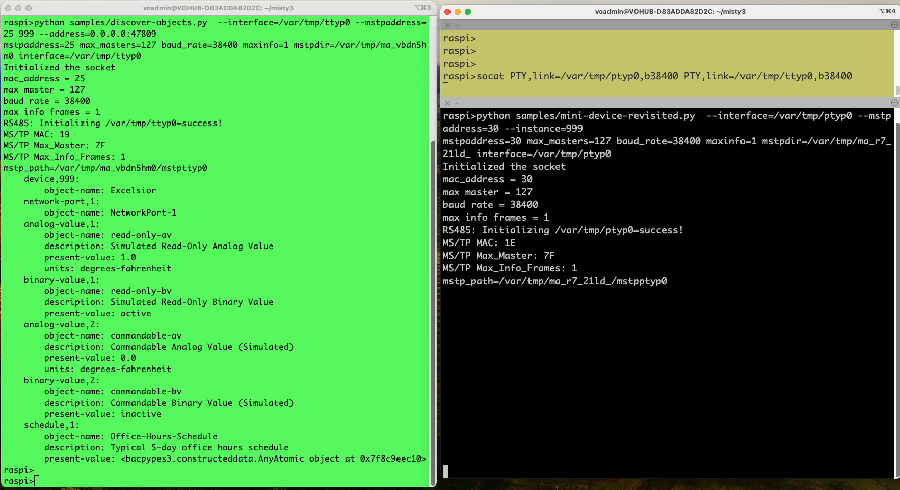

#  misty3

The misty3 project helps build [BACpypes3](https://github.com/JoelBender/BACpypes3)   applications that work on MS/TP Networks. The existing bacpypes3 BIP (BACnet IP ) applications can be easily ported to to use misty3 and work on MS/TP Networks.

# Table of Contents

- [misty3](#misty3)
- [Table of Contents](#table-of-contents)
- [Installation and Usage](#installation-and-usage)
  - [Prereqs (Linux / Raspberry Pi)](#prereqs-linux--raspberry-pi)
  - [Create a virtualenv](#create-a-virtualenv)
  - [Clone and install misty3](#clone-and-install-misty3)
  - [Running discover-objects Sample](#running-discover-objects-sample)
  - [Running Samples without Hardware Devices](#running-samples-without-hardware-devices)
- [Porting BACpypes3 IP Apps to MSTP](#porting-bacpypes3-ip-apps-to-mstp)
- [How does this Work ?](#how-does-this-work-)
- [Limitations](#limitations)

# Installation and Usage 

This section talks about the installation for people who are interested in using misty3 as a means to interact with the BACnet devices connected on a serial port to the Linux machine.

## Prereqs (Linux / Raspberry Pi)

```bash
sudo apt-get update
sudo apt-get install -y build-essential   # gcc, make
# optional: serial access for /dev/tty*
sudo usermod -a -G dialout $USER && echo "re-login for group change to take effect"
```
## Create a virtualenv
```bash
python -m venv .venv
source .venv/bin/activate
python -m pip install --upgrade pip
```

## Clone and install misty3
```bash
git clone https://github.com/raghavan97/misty3
cd misty3
# builds the C library and installs it
python -m pip install . 
```

Verify Installation
```bash
# This should show misty3
pip list
```

Force a clean, local rebuild if you see stale files

```bash
pip cache purge
rm -rf build dist *.egg-info src/build
python -m pip install --no-cache-dir --force-reinstall .
```

## Running discover-objects Sample

Start the discover-objects program present in the **samples** directory. This should show the objects present in the device specified

```bash
# specify the interface with your actual device e.g. /dev/ttyS3
# Specify the mstpaddress with your local mstp mac
# specify the device instance which you want to discover
python samples/discover-objects.py  --interface=/var/tmp/ttyp0 --mstpaddress=25 999
```

## Running Samples without Hardware Devices

The **socat** utility is useful  to test the MSTP applications without having  Hardware devices.

The following is the procedure for using *socat* to test the interaction of BACnet server and BACnet client.

(1) Execute the socat utility to create two connected virtual serial ports ptyp0 and ttyp0 in a terminal window. On **Linux** , use the following command
```bash
socat PTY,link=/var/tmp/ptyp0,b38400 PTY,link=/var/tmp/ttyp0,b38400
```
on **Macbook** use the following command
```bash
socat PTY,link=/var/tmp/ptyp0,rawer PTY,link=/var/tmp/ttyp0,rawer
```

(2) On a new terminal window , start the mini-device on ptyp0.
```bash
python samples/mini-device-revisited.py  --interface=/var/tmp/ptyp0 --mstpaddress=30 --instance=999
```
Add the debug option `--debug=misty3.mstplib.MSTPApplication` for additional debug information

(3) On a new terminal window, start the discover-objects on ttyp0. Specify a different port 47809 so that we can run 2 bacpypes3 applications on the same machine
```bash
python samples/discover-objects.py  --interface=/var/tmp/ttyp0 --mstpaddress=25 999 --address=0.0.0.0:47809
```
Add the debug option `--debug=misty3.mstplib.MSTPApplication` for additional debug information

The following image shows a sample interaction between the mini-device, and discover-objects program (running on the same machine using the ports created by socat utility



The following image shows the debug information displayed when the `--debug=misty3.mstplib.MSTPApplication` is passed to the discover-objects.py invocation. The transmitted BACnet packets (TX) and the received BACnet packets (RX) are shown


<br>

There are other samples that can be executed using the mini-device simulation on the other end 
- read-property
- write-property
- discover-devices

<br>

```bash
# 30 is the mstp address of the device we are trying to query
# The point being queried is analogValue instance 1
# the property is the present-value
python samples/read-property.py --interface=/var/tmp/ttyp0 --mstpaddress=25 --address=0.0.0.0:47809 30 analogValue:1 present-value

# 30 is the mstp address of the device we are trying to write to
# The point being written to is analogValue instance 2
# the property is the present-value
# The value that is being written is 87.32
python samples/write-property.py --interface=/var/tmp/ttyp0 --mstpaddress=25 --address=0.0.0.0:47809 30 analogValue:2 present-value 87.32


# The interface with your actual device is /var/tmp/ttyp0
# The local mstpaddress is 25
# The minimum device instance to discover is 999
# The maximum device instance to discover is 1000
python samples/discover-devices.py  --interface=/var/tmp/ttyp0 --mstpaddress=25 --address=0.0.0.0:47809 999 1000

```


# Porting BACpypes3 IP Apps to MSTP

To port an BACpypes3 Application to use the MSTP Networks, the following changes are required in the configuration file and application.

(1) Import and use the MSTPApplication from misty3.mstplib instead of Application from bacpypes3.app
```python
# from bacpypes3.app import Application
from misty3.mstplib import MSTPApplication as Application
```

(2) Use the MSTP Argument Parser instead of SimpleArgumentParser so that we get to supply mstp parameters along with the regular arguments
```python
# from bacpypes3.argparse import SimpleArgumentParser
from misty3.mstplib import MSTPArgumentParser as SimpleArgumentParser
```

The misty3/samples directory contains the bacpypes3 IP applications ported to use the MSTP Network
- [discover-devices.py](samples/discover-devices.py)
- [discover-objects.py](samples/discover-objects.py)
- [mini-device-revisited.py](samples/mini-device-revisited.py)
- [write-property.py](samples/write-property.py)
- [read-property.py](samples/read-property.py)

# How does this Work ?

For supporting BACpypes3 applications on MSTP Network, a new class for application called **MSTPApplication** has been created.  All the MSTP applications need to derive from the MSTPApplication.

A BACpypes3 application derived from MSTPSimpleApplication sends and receives data to an MSTP Agent. The MSTP Agent receives the packets sent out by the BACpypes3 application and sends it out on the Serial port using the Serial port Driver. In the response path, the Serial port Driver receives the MSTP Frame sent by the peer and passes it to the MSTP Agent. The MSTP agent hands it over to the BACpypes3 application.Each BACpypes3 application derived from MSTPSimpleApplication is tied to a Physical Interface (e.g. ttyS0).

The MSTP Agent relies on the open source [bacnet-stack version 0.8.4](https://sourceforge.net/projects/bacnet/files/bacnet-stack/) by skarg for communicating with the Serial port. The MSTP Agent uses the dlmstp_xxx functions of the bacnet-stack to send/receive the MSTP Frames and also to set configuration parameters of the Serial port (like baud rate, max_info).

The following image shows the idea on which the misty3 is based.


# Limitations
The following are the known limitations of MSTP Agent Project

*  Support for Linux only
